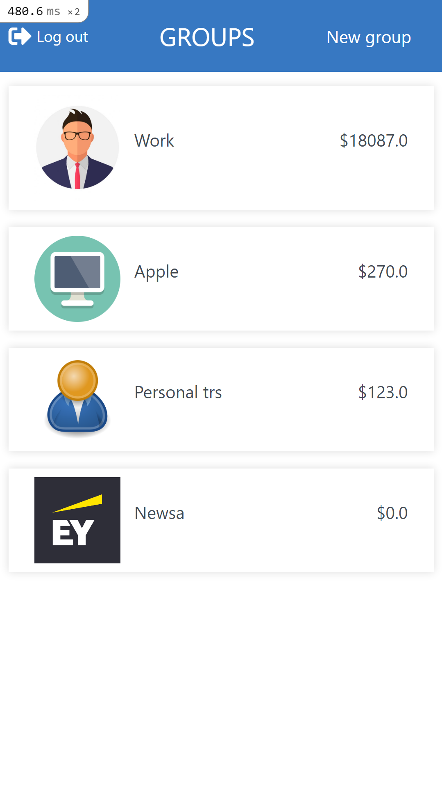
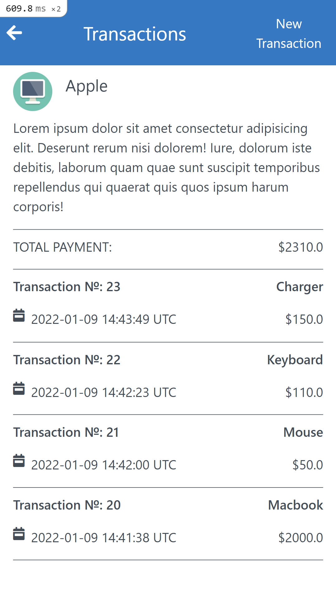

# Budget App

> The Budget app is a mobile web application where you can manage your budget: you have a list of transactions associated with a category so that you can see how much money you spent and on what.

  
## Built With

- Ruby
- Ruby on Rails
- Postgresql
- Bootstrap
- SASS

## Demo
My Heroku account is currently closed. I am actively searching for alternatives to Heroku.
- [Demo link](https://medamine-budget-app.herokuapp.com/) 

## Entity Relationship Diagram


## Getting Started

**To get a local copy up and running follow these simple example steps:**

### Prerequisites

- [Ruby](https://www.ruby-lang.org/en/)
- [Rails](https://gorails.com/)

### Setup

- Make sure you have Ruby on Rails set up properly on your computer

``` sh 
  git clone https://github.com/medaminedev66/budget-app.git
``` 
``` sh 
  cd budget-app
```

### Install

```sh
  bundle install
```

### Run

```
  rails db:create
```

```
  rails db:migrate
```

```
  rails s
```

### Test

```sh
  rspec
```
### Usage

To start budget app you need first to `signup`

## Authors

👤 **Amine Smahi**

- GitHub: [@medaminedev66](https://github.com/medaminedev66)
- Twitter: [@medaminesmahi](https://twitter.com/medaminesmahi)
- LinkedIn: [Mohammed Amine Smahi ](https://www.linkedin.com/in/md-amine-smahi/)

## 🤝 Contributing

Contributions, issues, and feature requests are welcome!

- Feel free to check the [issues page](https://github.com/faizi2500/recipe-app/issues).


## Show your support

- Give a ⭐️ if you like this project!


## Acknowledgments

- Microverse for giving me this chance
- The design template provider [Gregoire Vella on Behance](https://www.behance.net/gregoirevella).
